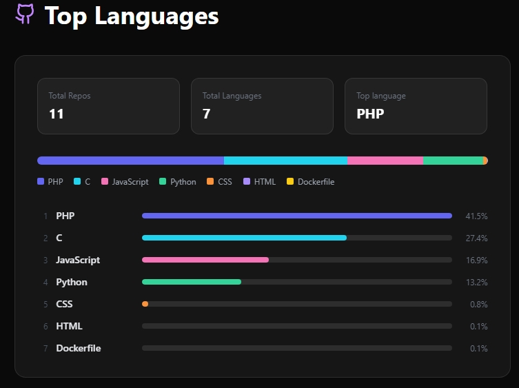

# TopLangs Component

A React component that displays the **top programming languages used in a GitHub user's repositories**, with bar visualization, statistics, and repository/language filtering.



## ✅ Requirements

- **React 18+**
- **lucide react** (Github icon component)
- **Tailwind CSS** (for styling)
- **Vite** (optional but recommended for environment variables)
- **GitHub Token** (to increase API request limits) [get one here](https://github.com/settings/tokens)


## ⚙️ Installation and Setup

1. **Add Tailwind CSS and lucide_react to your project**

If you are not using Tailwind, follow the [official guide](https://tailwindcss.com/docs/guides/create-react-app) to set it up.

To install lucide_react check [installation guide](https://lucide.dev/guide/).

2. **Create a `.env` file**

To use a GitHub token and avoid the 60 requests/hour limit:

```env
VITE_GITHUB_TOKEN=your_token_here
```

2. **Create TopLangs.jsx**

Copy the code of TopLangs.jsx and pase it into your app's `/src` folder on a file named TopLangs.jsx.

3. **OPTIONAL!! Customize language colors**

At the top of the file, change:

```javascript
const LANG_COLORS = [
  '#6366f1','#22d3ee','#f472b6','#34d399',
  '#fb923c','#a78bfa','#facc15','#f87171'
   ];
```

to your desired colors.

4. **Using the component**

On your `App.jsx`, inside the App function, paste the following code:

```javascript
import React, { useState, useEffect } from 'react';
import TopLangs from './TopLangs';
import { Github } from 'lucide-react';

function App() {
  return (
    <div>
      <TopLangs 
        username="your_username" 
        exclude={['languages', 'to_hide']} 
        excludeRepos={['repos', 'to_exclude']} 
      />
    </div>
  );
}

export default App;
```

| Prop | Default Value | Description |
|:---:|:---:|:---:|
| username | your_username | The github profile wich the GitHub API will calculate top languages from. |
| exclude | none | The github languages wich the GitHub API will ignore.|
| excludeRepos | none | The github repositories wich the GitHub API will not count.

## If you had any trouble using/setting up the component, please contact me! Contact info [here](https://diogo-lb-silva.vercel.app)
